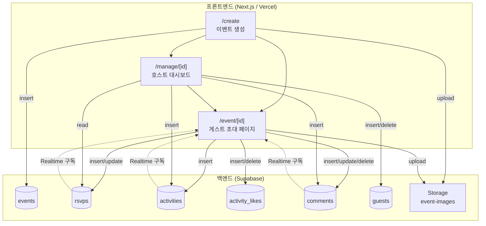
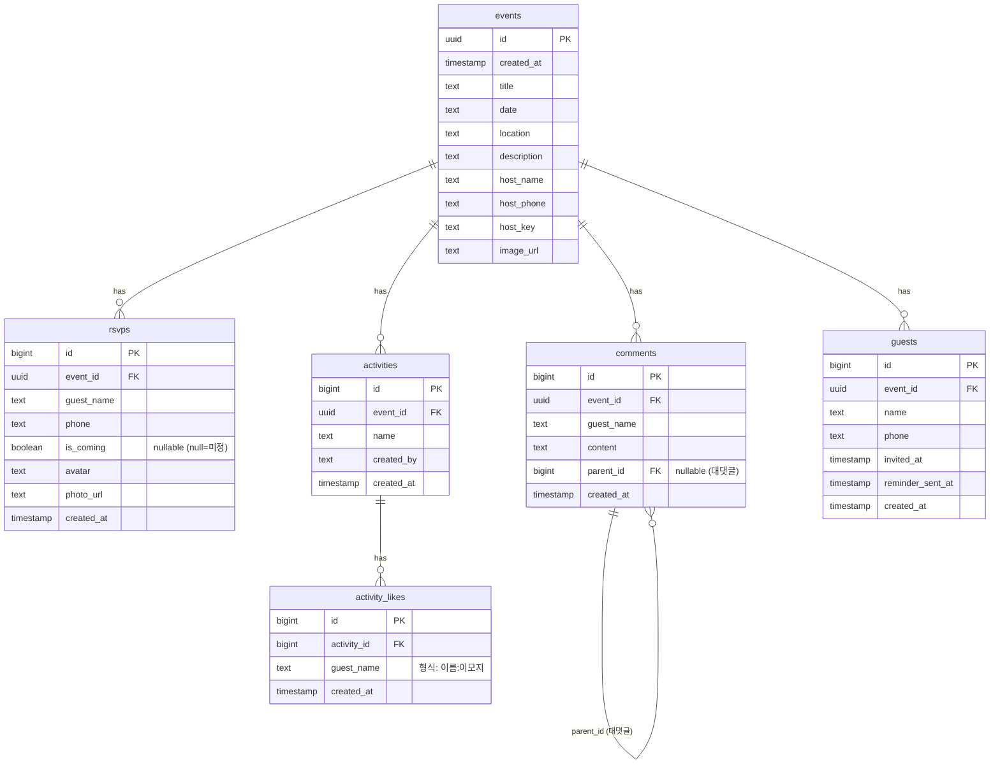
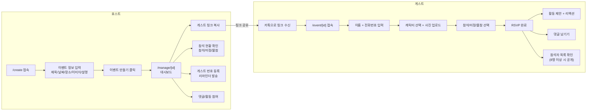
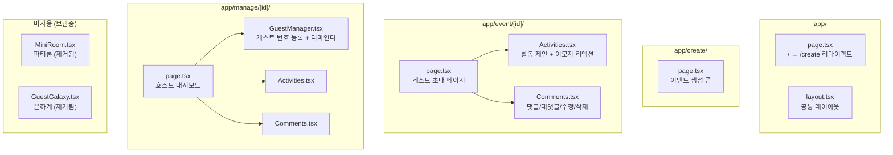
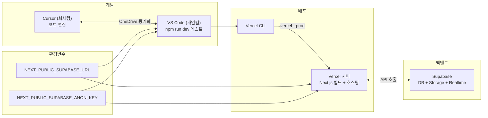

# invito-rsvp 시스템 구조
2026-05-03 기준

---

## 1. 전체 시스템 아키텍처

---

## 2. DB 스키마 (ERD)

---

## 3. 유저 플로우

---

## 4. 페이지별 컴포넌트 구조

---

## 5. 배포 구조

---

## 6. 색상 팔레트

| 용도 | 색상 | 코드 |
|------|------|------|
| 배경 | Beige | `#EFEFD0` |
| 카드/인풋 | White | `#FFFFFF` |
| 메인 액센트 | Orange Crayola | `#FF6B35` |
| 참석/CTA | Polynesian Blue | `#004E89` |
| 미정 | Peach | `#F7C59F` |
| 보조 블루 | Lapis Lazuli | `#1A659E` |
| 텍스트 | Dark | `#1a1a1a` |
| 보조 텍스트 | Muted | `#555550` |

---

## 7. 현재 상태 요약

- **프론트엔드**: Next.js 16 + React 19 + Tailwind CSS v4
- **백엔드**: Supabase (PostgreSQL + Storage + Realtime)
- **배포**: Vercel (미완 — 환경변수 설정 후 Redeploy 필요)
- **인증**: Supabase Auth 미사용, 호스트=폰+키, 게스트=이름+폰으로 식별
- **실시간**: RSVP/댓글/활동 Realtime 구독
- **SMS 리마인더**: UI만 구현, 실제 발송 미연동
